:title: Principal Component Cardinality via Normalized Maximum Likelihood
:css: preso.css
:data-transition-duration: 800

.. |br| raw:: html

   

.. |rarr| raw:: html

  &rarr;
.. role:: underline
    :class: underline

----

Minimum Description Length |br| |rarr| |br| Principal Components' Cardinality
=============================================================================

Ami Tavory |br| Facebook Research, Core Data Science
----------------------------------------------------------------------

.. note::

    Presenter console active

----

:data-x: r-20
:data-y: r-50
:data-scale: 0.01

Outline
========================

* :underline:`Introduction`

* MDL

* MDL Reduction for PCA

* Results and Conclusions

----

:data-x: r0
:data-y: r0
:data-scale: 0.0001

SVD |br| (Singular Value Decomposition)
==========================================

.. image:: svd.png
  :scale: 1

* :math:`X = X_{n \times m}`
* :math:`U`, `V` unitary
* :math:`\Sigma = \mathrm{diag}\left(\sigma_1, ..., \sigma_n\right)` eigenvalue matrix

----

:data-x: r0
:data-y: r0.15

PCA |br| (Principal Components Analysis) Approximation
=======================================================

.. image:: pca_orig_1.png
  :scale: 1

----

:data-y: r0.1
:data-rotate-y: -90

Focus Only on Dimensions
========================

.. image:: pca_reduced_1.png
  :scale: 1

----

:data-x: r0.0
:data-y: r0.0
:data-rotate-y: r90

.. image:: pca_reduced_2.png
  :scale: 1

----

:data-x: r0.0
:data-y: r0.1
:data-rotate-y: r-90

Which :math:`k` Should We Choose?
=================================

.. image:: pca_reduced_how_much.png
  :scale: 1

----

:data-x: r0.0
:data-y: r0.1
:data-rotate-y: r0

Minimize Reconstruction Error?
=================================

----

:data-x: r-0.1
:data-y: r0.05
:data-rotate-y: r0

.. class:: substep

  (Eckart-Young-Mirsky) For any :math:`k`

  .. math::

      \min_{W, V} \left| X - W_k V_k^T \right|_2^2  = \sum_{i = k + 1}^m\left[ \sigma_i^2\right].

----

:data-x: r-0.1
:data-y: r0.06
:data-rotate-y: r0

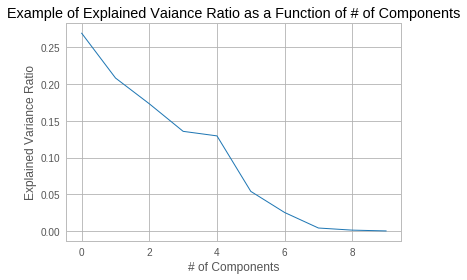

----

:data-x: r-0.1
:data-y: r0.05
:data-rotate-y: r0

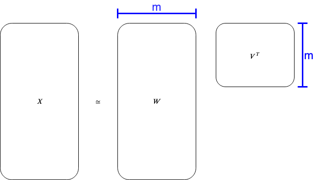

----

:data-x: r0.0
:data-y: r0.1
:data-rotate-y: r0

Find Knee/Elbow?
=================================

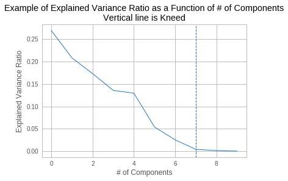

----

:data-x: r0.0
:data-y: r0.1
:data-rotate-y: r0

Utilize Eigenvalue Properties?
=================================

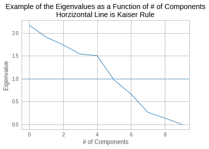

----

:data-x: r-0.07
:data-y: r-0.07
:data-z: r-0.07
:data-rotate-y: r0

Drawbacks
=================================

* Not very well established theoretically
* Known to be problematic in some cases

----

:data-x: r0
:data-y: r0
:data-rotate-y: 0
:data-scale: r100

Outline
========================

* Introduction

* :underline:`MDL`

* MDL Reduction for PCA

* Results and Conclusions

----

:data-x: r-0.3
:data-y: r0.3
:data-scale: 0.0001

Minimum Description Length Principle
==========================================

.. image:: Occam.png
    :class: center
    :height: 200px

The best hypothesis for a given set of data, is the one that leads to the best compression of the data (Rissanen).

----

:data-x: r0
:data-y: r0.15

Application to PCA Cardinality
==============================

.. image:: sender_receiver.png
  :scale: 1

----

:data-x: r0.03
:data-y: r0.05
:data-z: r0.05
:data-rotate-y: r0

.. image:: pca_delta.png
  :scale: 1
  :align: center

----

:data-x: r0.0
:data-y: r0.03
:data-z: r0.05
:data-rotate-y: r0

.. image:: sender_receiver_improved.png
  :scale: 1

----

:data-x: r0.0
:data-y: r0.3
:data-z: r0.0
:data-rotate-y: r0

Inherent Tradeoff
========================

.. image:: pca_reduced_1_comm.png
  :scale: 1

----

:data-x: r0.2
:data-y: r0.0
:data-z: r0.0
:data-rotate-y: r45

.. image:: pca_reduced_2_comm.png
  :scale: 1

----

:data-x: r-0.2
:data-y: r1.0
:data-z: r0.0
:data-rotate-y: r-45

How to Find the Description Length?
=====================================

.. class:: substep

  * Use Information Theory (Shannon) and Complexity Theory (Kolmogorov).

  * If we can impose a density :math:`f(X)` on an R.V. :math:`X`, then :math:`-\log\left(f(X)\right)` is (effectively) the answer.

  * Description length problem |rarr| distribution problem.

----

:data-x: r0.0
:data-y: r0.03
:data-z: r0.05
:data-rotate-y: r0

* But how should we choose a distribution for a model?

----

:data-x: r0
:data-y: r0.15
:data-z: r0.00
:data-rotate-y: r0

Normalized Maximum Likelihood
==============================

* Let :math:`X` be distributed according to a model parameterized by :math:`\Phi`.

* Let :math:`\hat{\Phi}\left(X\right)` be the ML (maximum likelihood) estimate of :math:`\Phi` for :math:`X`.

----

:data-x: r0.0
:data-y: r0.05
:data-z: r0.05
:data-rotate-y: r0

* The NML (normalized maximum likelihood) distribution is

  .. math::

    {f\left( X \;;\; \hat{\Phi}\left(X\right)\right) \over \int f\left( Y \;;\; \hat{\Phi}\left(Y\right)\right) dY }

* This is the "modern form" of MDL (Shtarkov, Rissanen)

  * Prequential (Dawid) optimality properties

----

:data-x: r0.0
:data-y: r0.052
:data-z: r0.05
:data-rotate-y: r0

Inutitively, :math:`f\left( X \;;\; \hat{\Phi}\left(X\right)\right)` an immediate choice,
but self-referential, cannot be used for transmission

  .. image:: self_referential.png
      :scale: 1

----

:data-x: r0.0
:data-y: r0.052
:data-z: r0.05
:data-rotate-y: r0

.. math::

  {f\left( X \;;\; \hat{\Phi}\left(X\right)\right) \over \int f\left( Y \;;\; \hat{\Phi}\left(Y\right)\right) dY }

also has a pleasing bias-variance tradeoff.

----

:data-x: r0
:data-y: r0.15
:data-z: r0.00
:data-rotate-y: r0

PCA As a Generative Model
=======================================================

  .. image:: plate1.png
    :class: center
    :height: 400px

:math:`\Phi \equiv k, \Upsilon`

----

:data-x: r-20
:data-y: r-50
:data-scale: 0.01

Outline
========================

* Introduction

* MDL

* :underline:`MDL Reduction for PCA`

* Results and Conclusions

----

:data-x: r0
:data-y: r0
:data-scale: 0.0001

Mathematical Difficulty of Calculating the NML
==============================================

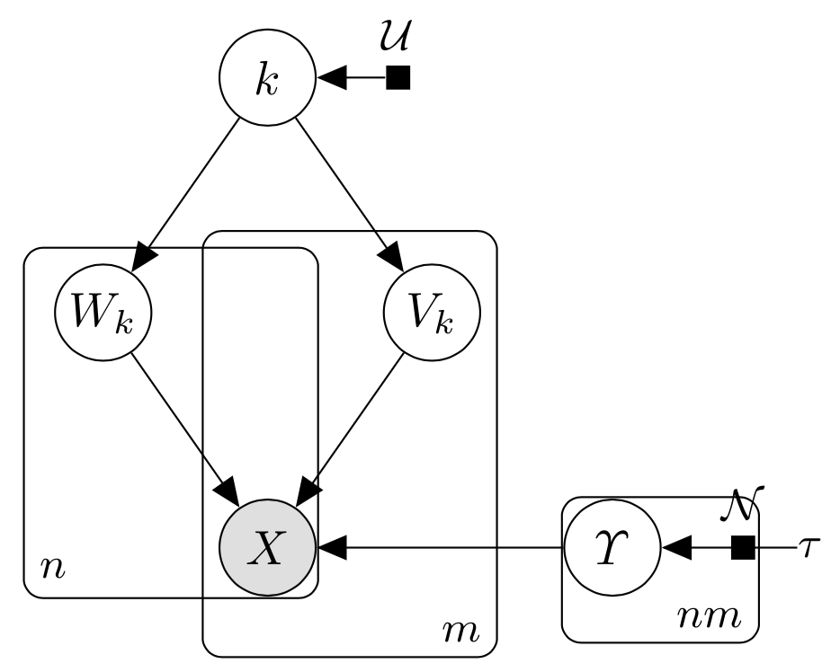

.. math::

  {f\left( X \;;\; \hat{k}\left(X\right), \hat{\Upsilon}\left(X\right)\right) \over \int f\left( Y \;;\; \hat{k}\left(Y\right), \hat{\Upsilon}\left(Y\right)\right) dY }

----

:data-x: r0.0
:data-y: r0.052
:data-z: r0.05
:data-rotate-y: r0

* Numerator easy (Eckart-Young-Mirsky)

* Denominator very difficult

----

:data-x: r0
:data-y: r0.15
:data-z: r0.0
:data-rotate-y: r0

Comparison with Linear Regression
=======================================================

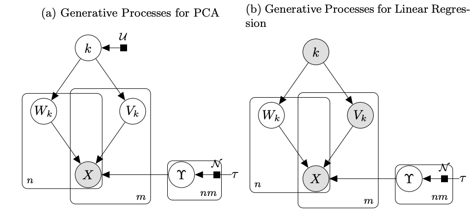

* Right process has a few more fixed parameters

* Sufficient for analytical solution for its denominator (Rissanen)

----

:data-x: r0
:data-y: r0.15
:data-z: r0.0
:data-rotate-y: r0

Eliminating Denominator Terms
=======================================================

For a parameter set :math:`\Phi = A \bigcup \{b\}`, consider

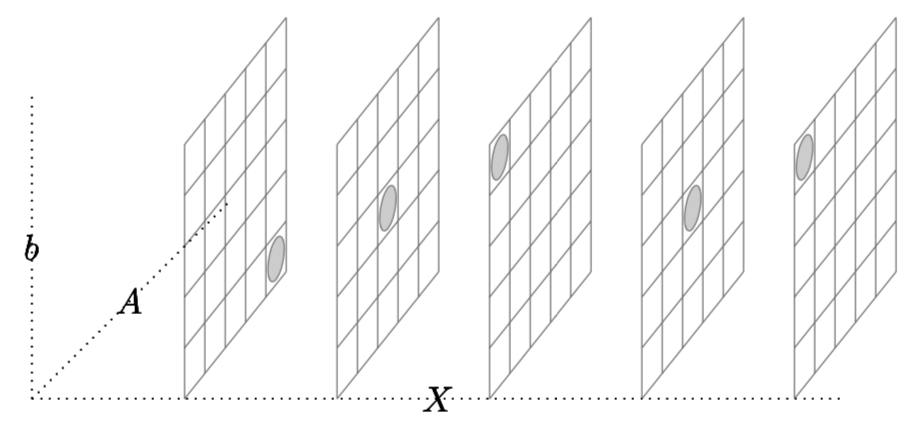

.. math::

  \int f\left( X \;;\; \hat{A}\left(X\right), \hat{b}\left(X\right)\right) dX

----

:data-x: r-0.13
:data-y: r0.13
:data-z: r0.0
:data-rotate-y: r0
:data-rotate-z: r0

Lower Bound
============

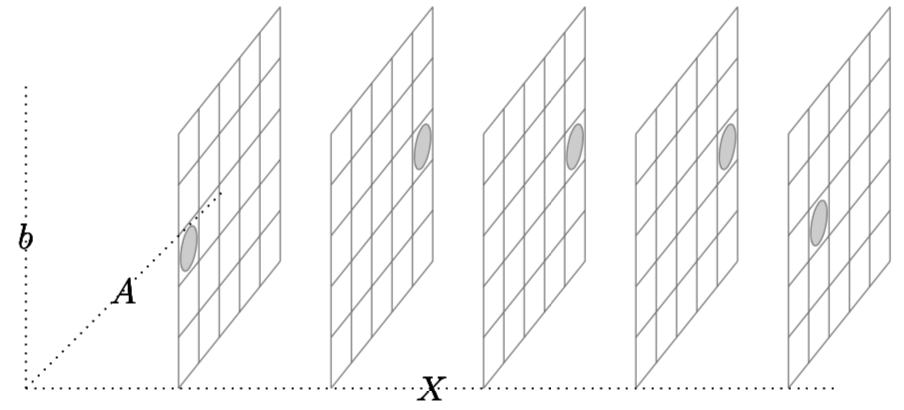

.. math::

  b = \arg \min_{b'} f\left( X \;;\; \hat{A}\left(X\right), b'\right)

----

:data-x: r0.26
:data-y: r-0.26
:data-z: r0.0
:data-rotate-y: r0
:data-rotate-z: r0

Upper Bound
============

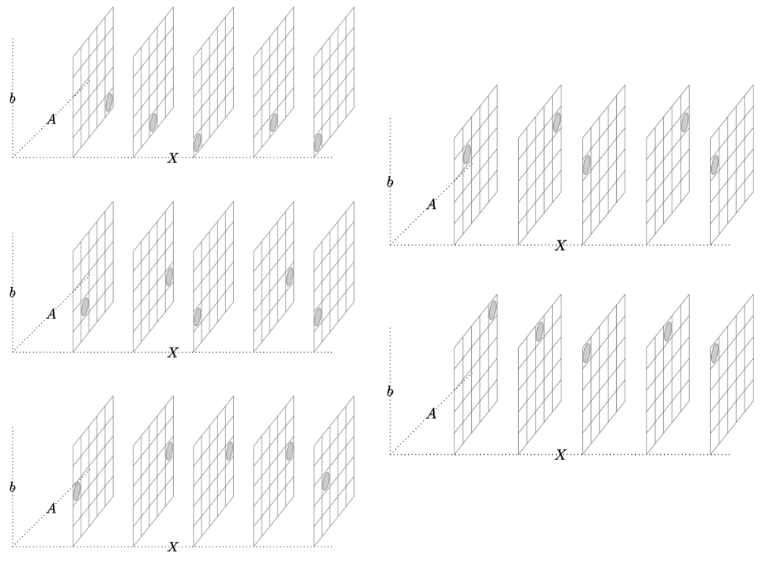

----

:data-x: r-0
:data-y: r0.2
:data-z: r0.15
:data-rotate-y: r0

Bounded by expressions of the form

  .. math::

    \int f\left( X \;;\; \hat{A}\left(X\right), b\right) dX

(for fixed :math:`b`) ~ linear regression

----

:data-x: r-0.1
:data-y: r0.22
:data-z: r0.0
:data-rotate-y: r0
:data-rotate-z: r0

Reducing PCA to Linear Regression
=================================

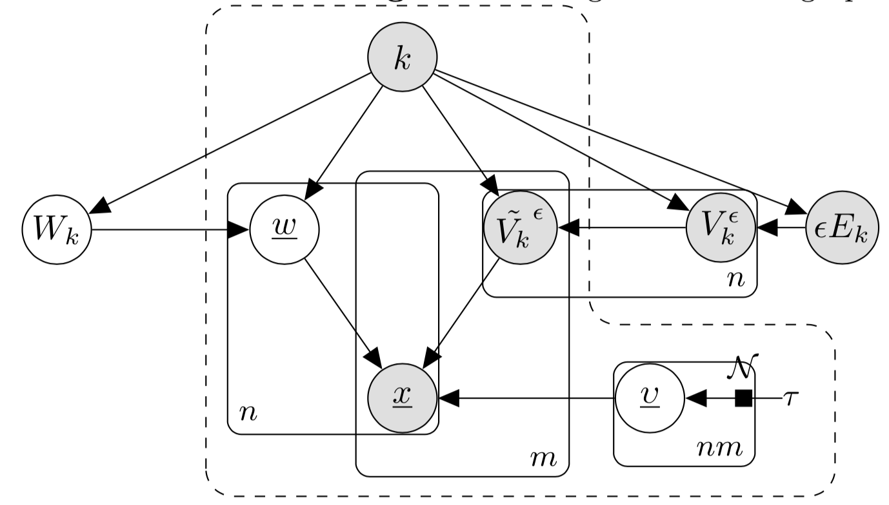

Most analysis involves properties of quantized unary matrices.

----

:data-x: 20000
:data-y: 70000
:data-rotate-y: 0
:data-scale: r100

Outline
========================

* Introduction

* MDL

* MDL Reduction for PCA

* :underline:`Results and Conclusions`

----

:data-x: r50000
:data-y: r90000
:data-rotate-y: 0
:data-scale: r1

Main Result
===========

Let :math:`s\left(X \;;\; k\right)` be the stochastic complexity of a :math:`k`-dimensional PCA reduction of :math:`X`.

.. math::

  s(X \;;\; k)
  \simeq
  \left( nm - kn \right) \ln\left(\sum_{i = k + 1}\left[\lambda_i^2\right]\right)
  + nk \ln\left( \left| X^T X\right|_2^2 \right)
  +
  \\
  (mn - kn - 1) \ln\left( mn \over mn - kn \right)
  -
  (nk + 1) \ln\left(nk\right)
  + \Delta s
  ,

where

.. math::

  0 &\leq \Delta s \leq mk \ln\left(2 \over m \epsilon\right)
  .

----

:data-x: r0
:data-y: r100000

Numerical Experiments
=====================

* Historical Dow-Jones Industrial Average

* Sets:

  * Orig - all 30 assets

  * Lin10 - 10 assets, 20 random linear combination + noise

  * Lin50 - 5 assets, 25 random linear combination + noise

----

:data-x: r0
:data-y: r100000

Explained Variance
=====================

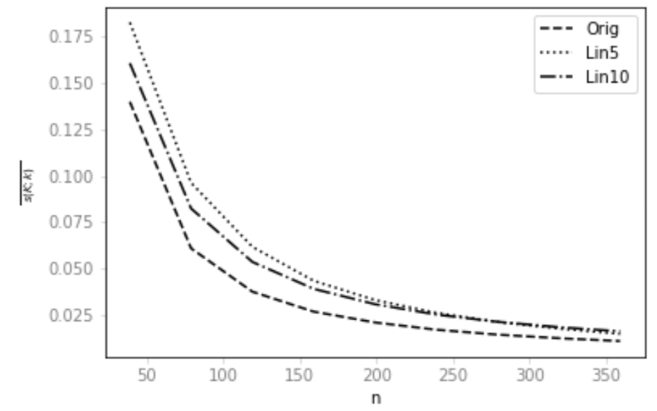

----

:data-x: r130000
:data-y: r0

Knee Results
=====================

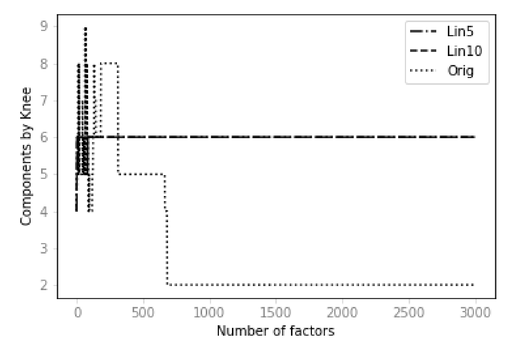

----

:data-x: r130000
:data-y: r0

MDL Results
=====================

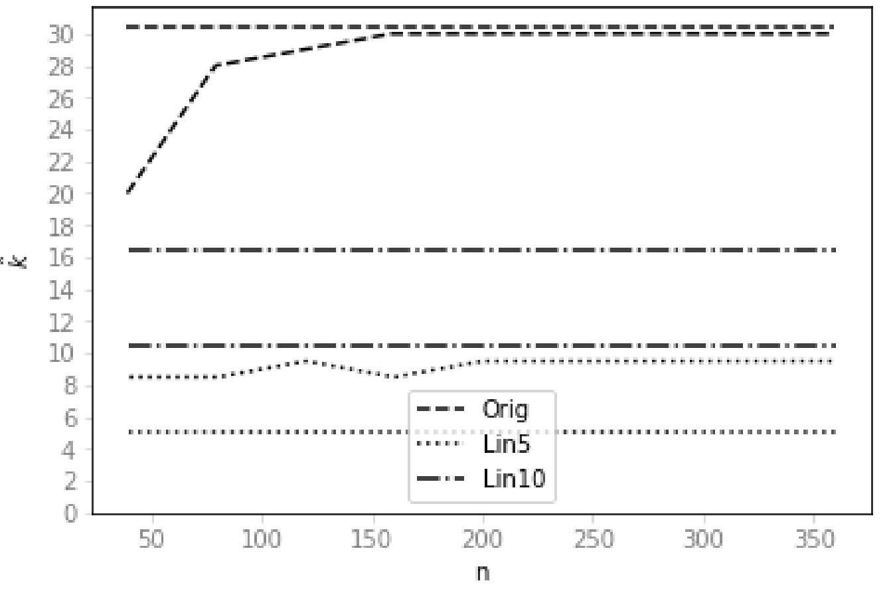

----

:data-x: r450000
:data-y: r350000
:data-scale: r1000

Main Points
=====================

* MDL - approach to unsupervised model selection

  * Theoretically justified

* NML is difficult to calculate

  * NML for embeddings, e.g.

* Saw a technique for NML reduction

* Applied technique to PCA
