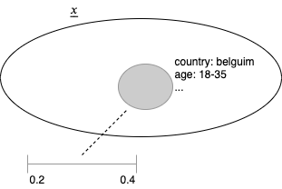
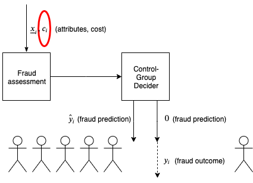
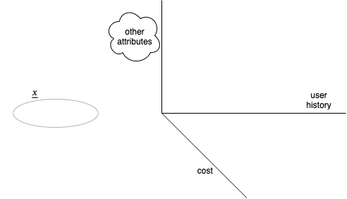
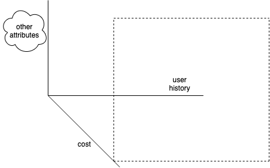
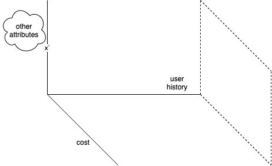
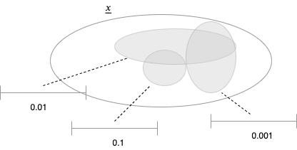
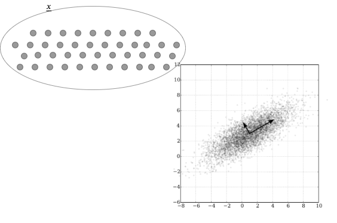

:title: Holdout Groups for Expensive and Adversarial Settings
:data-transition-duration: 800
:css: preso.css

.. |br| raw:: html

   

.. |rarr| raw:: html

  &rarr;

.. |space| raw:: html

  &#8205; &#8205; &#8205; &#8205; &#8205; &#8205; &#8205; &#8205; &#8205; &#8205; &#8205;

.. role:: underline
    :class: underline

----

Holdout Groups for |br| Expensive and Adversarial Settings
===========================================================

.. image:: img/tlv.png
    :class: center
    :height: 200px

Ami Tavory, |br| |space| Facebook Research, Core Data Science
----------------------------------------------------------------

:id: title

.. note::

    Presenter console active

----

:data-x: r-20
:data-y: r300
:data-scale: 0.01

Attributes+Const Online System
=================================

----

:data-x: r20
:data-y: r0
:data-scale: 0.01

Online Fraud Detection |br| and Its Assessment
===============================================

.. image:: img/system_init.png
    :class: center
    :height: 500px

----

:data-x: r0
:data-y: r10
:data-rotate-x: 45
:data-scale: 0.02

.. image:: img/system_init_dumb.png
    :class: center
    :height: 500px

----

:data-x: r30
:data-y: r-10
:data-rotate-x: 0
:data-scale: 0.01

Classic Holdout Group Solution
=================================

.. image:: img/system_classic.png
    :class: center
    :width: 500px

----

:data-x: r0
:data-y: r10
:data-rotate-x: 45
:data-scale: 0.02

----

:data-x: r30
:data-y: r-14
:data-rotate-x: 0
:data-scale: 0.01

Standard Problems
=================================

----

:data-x: r-4
:data-y: r3
:data-scale: 0.01

----

:data-x: r9
:data-y: r1
:data-scale: 0.01

.. image:: img/importance_problem.png
    :class: center
    :width: 500px

----

:data-x: r30
:data-y: r1
:data-scale: 0.01

Unique Problem
=================================

----

:data-x: r-3
:data-y: r15.5
:data-rotate-x: 45
:data-scale: 0.04

.. image:: img/nietsche.png
    :class: center
    :width: 1300px

----

:data-x: r33
:data-y: r-15
:data-rotate-x: 0
:data-scale: 0.01

General Principles
=================================

----

:data-x: r-4
:data-y: r3
:data-scale: 0.01

.. image:: img/system_trx_level.png
    :class: center
    :width: 500px

----

:data-x: r9
:data-y: r1
:data-scale: 0.01

.. image:: img/assess_objective_borrow.png
    :class: center
    :width: 500px

----

:data-x: r30
:data-y: r1
:data-scale: 0.01

Outline
=================================

* :underline:`Borrowing via Gaussian Processes`

* Explore Exploit

* Feature Space and Gaming

* Conclusions, Further Problems

----

:data-x: r0
:data-y: r0
:data-scale: 0.0001

Estimating log(Fraud Counts) As Gaussians
==========================================

.. image:: img/feature_space_gaussian.png
    :class: center
    :width: 600px

----

:data-x: r0
:data-y: r0.08
:data-rotate-x: 45
:data-scale: 0.0003

.. image:: img/feature_space_gaussian_posterior.png
    :class: center
    :width: 600px

----

:data-x: r0
:data-y: r0.5
:data-rotate-x: -45
:data-scale: 0.0006

.. image:: img/assess_objective_borrow_objective.png
    :class: center
    :width: 600px

----

:data-x: r0.5
:data-y: r-0.53
:data-rotate-x: 0
:data-scale: 0.0001

System Based on Gaussian-Process Regression
============================================

.. image:: img/system_with_gps.png
    :class: center
    :width: 600px

----

:data-x: r15
:data-y: r0
:data-scale: 0.01

Outline
=================================

* Borrowing Via Gaussian Processes

* :underline:`Explore Exploit`

* Feature Space and Gaming

* Conclusions, Further Problems

----

:data-x: r0
:data-y: r0
:data-scale: 0.0001

Should We Choose this Transaction?
==========================================

.. image:: img/much_wow.png
    :class: center
    :width: 700px

----

:data-x: r0.5
:data-y: r0
:data-scale: 0.0001

Assessing "High Learnings"
==========================================

* How much will overall fraud-rate estimate improve, if we take this transaction.

* Suppose for :math:`(\underline{x_i, c_i})`, the current fraud estimate is 0.3

----

:data-x: r0
:data-y: r0.04
:data-scale: 0.0001

.. image:: img/should_take_cases.png
    :class: center
    :width: 700px

----

:data-x: r0.5
:data-y: r0
:data-scale: 0.0001

Reducing Comp. Complex. with Preprocessing
==========================================

.. image:: img/added_assessment.png
    :class: center
    :width: 700px

----

:data-x: r0
:data-y: r0.11
:data-rotate-x: 45
:data-scale: 0.0005

.. image:: img/removed_assessment.png
    :class: center
    :width: 700px

----

:data-x: r30
:data-y: r1
:data-scale: 0.01

Outline
=================================

* Borrowing Via Gaussian Processes

* Explore Exploit

* :underline:`Feature Space and Gaming`

* Conclusions, Further Problems

----

:data-x: r0
:data-y: r0
:data-scale: 0.0001

The Feature Space
==========================================

----

:data-x: r-0.2
:data-y: r0.2
:data-scale: 0.0001

Interesting Region Example |br| (High Cost)
============================================

----

:data-x: r0.2
:data-y: r0
:data-scale: 0.0001

Interesting Region Example |br| (Little Interference)
=====================================================

----

:data-x: r0.2
:data-y: r-0.2
:data-scale: 0.0001

.. image:: img/nietsche2.png
    :class: center
    :width: 1300px

----

:data-x: r0.2
:data-y: r0
:data-scale: 0.0001

Probability Chain-Adjustment
=====================================================

.. image:: img/chain.png
    :class: center
    :height: 100px

----

:data-x: r0
:data-y: r0.05
:data-scale: 0.0001

.. image:: img/adjusted_chain.png
    :class: center
    :height: 100px

----

:data-x: r0
:data-y: r0.05
:data-scale: 0.0001

.. math::

  &P(c_{u, 1}, \ldots, c_{u, n}) = \\
  &P(c_{u, 1}) {P(c_{u, 1} + c_{u, 2}) \over P(c_{u, 1})} \cdots
  {P(c_{u, 1} + \cdots + c_{u, n - 1} + c_{u, n}) \over P(c_{u, 1} + \cdots + c_{u, n - 1})} =\\
  &P(c_{u, 1} + \cdots + c_{u, n - 1} + c_{u, n})

----

:data-x: r30
:data-y: r1
:data-scale: 0.01

Outline
=================================

* Borrowing Via Gaussian Processes

* Explore Exploit

* Feature Space and Gaming

* :underline:`Conclusions, Other Problems`

----

:data-x: r0
:data-y: r0
:data-scale: 0.0001

Conclusions
==========================================

* Holdout setting for adaptive adverserial setting

* GPs

  * Borrow strength for queries

  * Allow explore/exploit

* Must engineer feature space for fraudsters' adaptiveness

----

:data-x: r30
:data-y: r-10
:data-rotate-x: 0
:data-scale: 0.01

Constraint Optimization
=================================

----

:data-x: r30
:data-y: r-10
:data-rotate-x: 0
:data-scale: 0.01

Reduced Complexity via Quantization
====================================

----

:data-x: r30
:data-y: r1
:data-scale: 0.01

